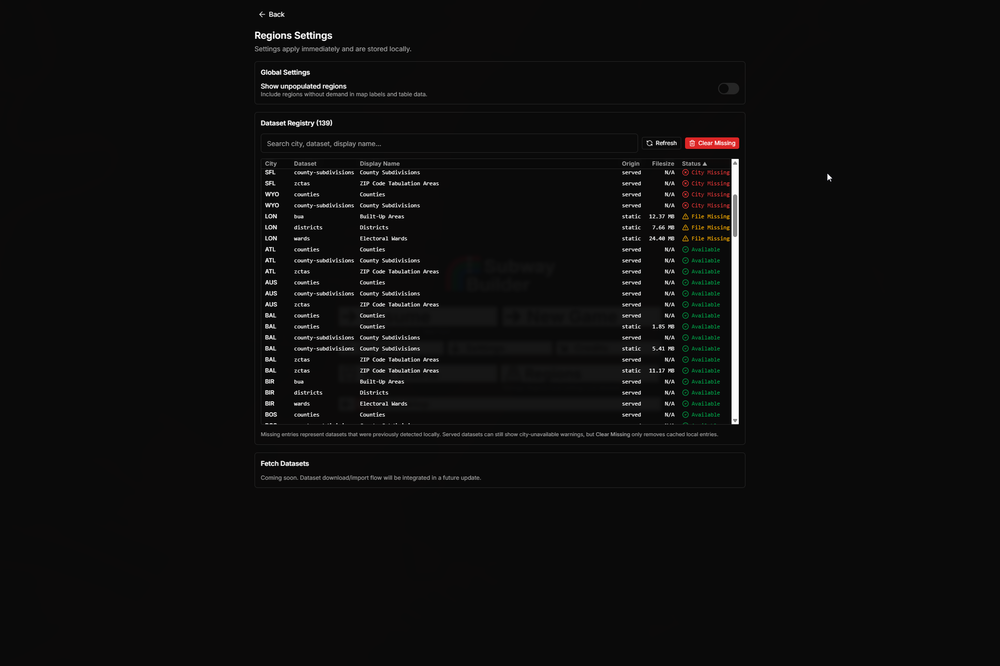
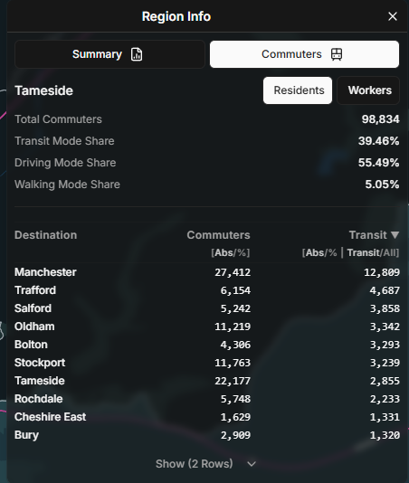
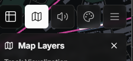
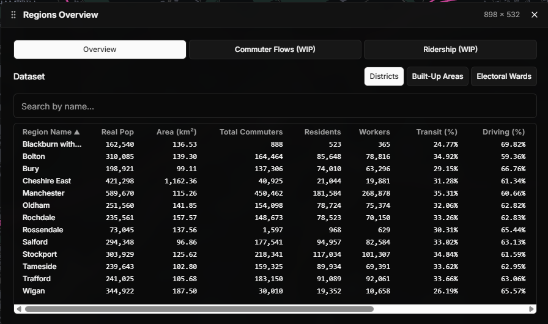

# subwaybuilder-regions

This repository contains a standalone mod, **SubwayBuilder Regions**, for the game [SubwayBuilder](https://www.subwaybuilder.com/).

## Summary

> **SubwayBuilder Regions** allows users to import real-world geographic regions (e.g. ZIP codes, counties, wards) into the game SubwayBuilder,
>
> The mod adds a visualization layer on top of the in-game map as well as additional panels for region-based statistics such as population, commuter flows, and infrastructure.

_Latest Mod Version:_ `v0.3.3`  
_Latest Tested Game Version:_ `v1.1.0`
_Latest Changelog Entry:_ [v0.3.3](CHANGELOG.md#v033---2026-02-23)

## Table of Contents

- [Features](#features)
- [Specifications](#specifications)
- [Installation](#installation)
  - [General User Installation](#general-user-installation)
  - [Dev Installation](#dev-installation)
- [Usage](#usage)
- [Planned Features](PLANNED_FEATURES.md#planned-features)
- [Known Issues](KNOWN_ISSUES.md#known-issues)
- [Changelog](CHANGELOG.md#changelog)
- [Contributing](#contributing)
  - [Developer Commands](#developer-commands)
  - [Release Process](RELEASING.md#releasing-subwaybuilder-regions)
- [Credits](#credits)

## Features

- **Interactive Map Layers**: Displays region-based data as interactive layers on the in-game map.
  - Multiple region layers can be loaded per city
  - Each region layer is exposed in the game's `Map Layers` toggle screen
- **Region-Level Information**: Information for the following is exposed to the user when a region is selected:
  - Region Characteristics (total population / area / etc.)
  - Commuter Data (origin / destination by region / etc.)
  - Infrastructure Data (station count / track length / routes / etc.)
- **Settings Menu (Main Menu)**:
  - `Regions` entry button in the main menu for global settings and dataset registry visibility
  - Dataset registry refresh and cleanup controls for local cache maintenance
- **Dynamic Data State**: Region-based data is dynamically updated based on the game state
  - :information_source: Currently, this is limited to just the commuter data
- **Compressed Data Support**:
  - Runtime and scripts support both `.geojson` and `.geojson.gz` datasets
- **Preset Regions**: Scripts to obtain region boundaries for the following real-world geographical divisions are provided:
  - **CA** (Canada)
    - Federal Electoral Districts
    - Provincial Electoral Districts
    - Census Subdivisions
    - Forward Sortation Areas
  - **GB** (United Kingdom)
    - Local Authority Districts
    - Built-up Areas
    - Electoral Wards
  - **US** (United States)
    - Counties
    - County Subdivisions (including towns/cities/CDPs)
    - ZIP Code Tabulation Areas

## Specifications

- **Region Data**:
  - Region boundary data is stored on the local machine in GeoJSON format
  - :warning: Features must have Polygon/MultiPolygon geometry
  - :warning: Overlapping boundary data will likely cause issues. Avoid if possible during pre-processing
- **Local Data Server**:
  - Currently, data is exposed to the game via a configurable local HTTP server (`scripts/serve-data.ts`)
  - This will be moved to local storage as the mod API matures
- **Key Files/Directories**:
  ```
  - data/                   -- Output directory for boundary data
    - data_index.json       -- JSON file of available datasets (for consumption by mod)
  - scripts/                -- Scripts for downloading / serving local data
  - src/                    -- Core mod logic
  - shared/                 -- Shared values between dev / runtime
  - source_data/            -- Folder for pre-downloaded boundary source data
    - boundaries.csv        -- CSV of city codes to boundary boxes
  ```

### GeoJSON Feature Requirements

- **Required**
  - `ID` - unique identifier
  - `NAME`

- **Optional**
  - `DISPLAY_NAME`
  - `POPULATION`
  - `TOTAL_AREA`
  - `AREA_WITHIN_BBOX`

## Installation

> :warning: The prebuilt release for general users lags behind the dev build and may be unstable!

### General User Installation

1.  Under the game's mod folder, create a new `regions/` directory if one does not already exist.

2.  Navigate to this repository's **Releases** [section](https://github.com/ahkimn/subwaybuilder-regions/releases) and download the latest release

    Un-zip the file and copy the `index.js` and `manifest.json` directly into the `mods/regions/` directory

3.  Visit the shared [Google Drive](https://drive.google.com/drive/folders/1TPlqNRh-zqJTIoTs-KUNdZHVVTS0QCzd?usp=drive_link) and download the `.zip` files of the cities you intend to play with.

    Un-zip each city's files into its own `mods/regions/data/{CITY_CODE}/` directory.
    For example, if you download the `ATL` .zip for Atlanta files your directory should look like

    ```
    mods/
      regions/
        index.js
        manifest.json
        data/
          ATL/
            counties.geojson
            county-subdivisions.geojson
            zctas.geojson
          AUS/
            ...
    ```

4.  Open the game, navigate to `Mod Manager` within the `Settings` menu and enable the `Regions` mod.
5.  Restart the game to ensure that the mod load properly.
6.  Load a city for which you have downloaded region-level data and enjoy!

### Dev Installation

1. Clone repository & Install dependencies

   ```
     git clone https://github.com/ahkimn/subwaybuilder-regions.git;
     cd subwaybuilder-regions;
     npm install
   ```

2. Update City Config (Optional)

   The `boundaries.csv` contains the boundary box for clipping regions to all of the game's current cities. If you are working on a custom city, please add an entry for the custom city within the file

3. Build Boundary GeoJSONs

   From the project repository root, run

   ```
   npx tsx scripts/extract-map-features.ts \
    --country-code=US \
    --data-type=zctas \
    --city-code=DEN
   ```

   Or if using Powershell

   ```
   npm run extract:map-features -- -- \
     --country-code=US \
     --data-type=zctas \
     --city-code=DEN
   ```

   To override the boundaries set in `boundaries.csv`, manually provide a boundary box

   ```
   npx tsx scripts/extract-map-features.ts \
     --country-code=US \
     --data-type=zctas \
     --city-code=DEN \
     --west=-105.2 \
     --south=39.5 \
     --north=40.1 \
     --east=-104.6
   ```

   This command generates clipped GeoJSON files under `data/`, which are later served to the game via the local data server.

   **Preset Parameters**

   The following are the current valid combinations of `country-code` and `data-type` for preset data

   | `country-code` | `data-type `        | description                             | source                       |
   | -------------- | ------------------- | --------------------------------------- | ---------------------------- |
   | **CA**         | feds                | Federal Electoral Districts             | Statistics Canada API        |
   | **CA**         | peds                | Provincial Electoral Districts          | Provincial Elections GeoJSON |
   | **CA**         | csds                | Census Subdivisions                     | Statistics Canada API        |
   | **CA**         | fsas                | Forward Sortation Areas                 | Statistics Canada API        |
   | **GB**         | districts           | Local Authority Districts (LADs)        | ONS (online)                 |
   | **GB**         | bua                 | Built Up Areas                          | ONS (online)                 |
   | **GB**         | wards               | Electoral Wards                         | ONS (online)                 |
   | **US**         | counties            | Counties                                | TIGERweb API (online)        |
   | **US**         | county-subdivisions | County Subdivisions (Towns/Cities/CDPs) | TIGERweb API (online)        |
   | **US**         | zctas               | ZIP Code Tabulation Areas               | TIGERweb API (online)        |

   :warning: If adding boundaries for a custom city, `city-code` must be in `boundaries.csv`

   **Runtime Fetch CLI (single city, explicit bbox)**

   To replicate release/runtime-compatible generation, use the dedicated fetch CLI with explicit bbox and dataset list:

   ```
   npx tsx scripts/fetch-city-datasets.ts \
     --cityCode=NYC \
     --countryCode=US \
     --datasets=counties,county-subdivisions,zctas \
     --west=-74.601721 \
     --south=40.233767 \
     --east=-73.405397 \
     --north=41.195732 \
     --out=./data \
     --compress=true
   ```

   Supported datasets for this runtime CLI:
   - `US`: `counties`, `county-subdivisions`, `zctas`
   - `GB`: `districts`, `bua`, `wards`
   - `CA`: `feds`, `csds`, `fsas` (`peds` requires a local dataset)

   **Rest of the World**

   For the rest of the world, the mod supports boundary fetching via OSM by admin level. Valid combinations are set in `source_data/osm-country-admin-levels.json`

   Entries within this JSON parameterize the OSM query that the boundary extraction script. See `scripts/utils/osm-country-configs.ts` for additional details.

   ```
    {
      "countryCode": "FR",
      "availableBoundaryTypes": [
        {
          "adminLevels": [7],
          "datasetId": "arrondissements",
          "suffixesToTrim": [],
          "prefixesToTrim": [],
          "unitSingular": "Arrondissement",
          "unitPlural": "Arrondissements"
        },
        {
          "adminLevels": [8],
          "datasetId": "communes",
          "suffixesToTrim": [],
          "prefixesToTrim": [],
          "unitSingular": "Commune",
          "unitPlural": "Communes"
        }
      ]
    }
   ```

   Once an entry is added to this JSON, run the extraction script as follows:

   ```
   npx tsx scripts/extract-map-features.ts \
     --country-code={countryCode} \
     --data-type={datasetId} \
     --city-code={ ??? }
   ```

   For example, given the example config for France and an entry for `PAR` within `boundaries.csv` you could run the following to get boundary data for Paris:

   ```
   npx tsx scripts/extract-map-features.ts \
     --country-code=FR \
     --data-type=communes \
     --city-code=PAR
   ```

4. Export City Archives (Optional)

   To package all datasets for a city into `export/{CITY_CODE}.gz` archives:

   ```
   npx tsx scripts/export-data-archives.ts --city-code=TOR
   ```

   Due to varying data quality, boundary data from OSM is excluded by default. To include OSM-sourced datasets in the archive, run:

   ```
   npx tsx scripts/export-data-archives.ts --city-code=TOR --include-osm-data
   ```

   :information_source: By default (`--include-osm-data=false`), OSM datasets are excluded based on each dataset's `source` in `data/data_index.json` (not by filename conventions).

5. Serve Local Data
   From the repository root, run:

   ```
   npm run serve
   ```

   By default this serves: http://127.0.0.1:8088.

6. Build
   From the repository root, run:

   ```
   npm run build
   ```

   This will build the `index.js` in `dist/`

7. Install

   Move the built `index.js` as well as the mod's `manifest.json` in the root directory to the mod's folder in the game's mod directory.

   Alternatively, use the following command (requires `config.yaml`) to create symlinks between the dev folder and the mod directory:

   ```
   npm run link
   ```

   :information_source: The `config.yaml` file can be created from `config.example.yaml` and updating the `gamePath` / `baseModsDir` / `modDirName`.

8. Validate Behavior

   Use the following command to run the game from terminal with the Console enabled (requires `config.yaml`).

   ```
   npm run dev

   ```

9. Contribute

   Once new behavior is verified, run code quality checks before opening a PR:

   ```
   npx tsc --noEmit
   npm run lint
   npm run format:check
   ```

### Disclaimer

> :warning: This mod was developed on Windows, behavior on other platforms is undetermined
>
> If you encountered issues while working with the mod, please:
>
> - Raise an issue (see [Contributing](#contributing)) on the repository
> - Send a message within the mod's dedicated thread within the game's [Discord server](https://discord.gg/97JhJprW)

## Usage

This section covers the core mod functionalities and their usage.

### Settings Menu

From the game's main menu, open the `Regions` button to manage global mod settings and inspect dataset registry entries.

- `Refresh` rebuilds the local dataset snapshot cache and persists the result to game-level local storage.
- `Clear Missing` removes stale cache entries that no longer resolve to usable local files/cities.



### Toggling Map Layers

Each GeoJSON installed will correspond to a single map layer for a city.

Installed map layers are accessible via the game's existing `Map Layers` menu. The mod injects a new section of toggle buttons `Region Data Layers` to this dropdown panel.


Clicking on these toggles will enable/disable the display of the corresponding map layer.

### Selecting A Region

Once a map layer is toggled on, the boundaries of regions within the map layer will be rendered on the screen.

The labels for each region are clickable, and will change color when hovered over. Click on the label to activate selection for the corresponding region.


If a region is already selected, clicking on its label will remove selection. Clicking a different region will switch the selection to that region.

### Info Panel

Once any new region is selected, the Regions Info panel will open in the top right corner of the screen

#### Summary View


The initial `Summary` panel contains overall summary statistics about the selected region.

You can swap between this view and the other `Commuters` view described below by clicking on the buttons at the top of the panel.

:warning: The first time a region is selected, infrastructure data is calculated asynchronously and may take some time to render on the panel.

#### Commuters View

The commuters view for a region contains a breakdown of commuter counts and commuter mode share. There are two views for this panel. `Residents` and `Workers`.

- `Residents` refer to commuters who reside within the selected region
- `Workers` refer to commuters who work within the selected region
- :information_source: A commuter can be both a `Resident` and a `Worker` of the same region if both their residence and workplace are within the region's boundaries



The upper portion of the view contains statistics of `Resident` and `Worker` counts and mode share aggregated for the selected region.

The lower portion of the view consists of a data visualization section breaking this information down for a selected `Breakdown` of the selected region's commute data.

There are three available data `Breakdown` options:

- `Region`: Filter commuters by the region of destination / origin (for residents and workers respectively)
- `Length`: Filter commuters by the length of their commute
- `Time`: Filter commutes by the departure time of the commuter. Note that a commuter can have more than one commute (e.g. Work to Home and Home to Work)

There are also three vailable data `View` options:

- `Table`: A simple table containing the breakdown categories as well as transit mode shares
- `Sankey`: A sankey diagram
- `Bar`: A bar chart

##### Table Visualization UX

You can sort the table by clicking on column headers. If there is a tie, the previous sort column and/or the region name are used as tiebreakers.

Use the footer to expand and show additional rows when available.

:information_source: The `Commuters` view is automatically updated with fresh demand data if at least 15 in-game minutes have passed.

### Overview Panel

In addition to a per-region view, the mod also implements a `Region Overview` where statistics / data visualizations across all regions within a dataset are visible at a time. This is accessible via a new top-bar button to the left of the `Map Layers` button.



At the top of the panel are the set of tabs for the panel. Currently, only the `Overview` tab is available, but additional tabs will be added in the future.

Below the set of tabs are a set of buttons to navigate between data for the datasets loaded for the city

:warning: The Overview Panel will only be accessible if there is data present for the city being loaded

:information_source: Tab / Dataset / Sort selection will persist even if the panel is closed

#### Overview Tab

The first tab available within this panel is the `Overview` tab. This panel contains summary statistics for each region similar to that shown on the `Info Panel`.



The list of regions can be filtered by using the search bar to filter by region name.

Clicking on a region within the `Overview` tab works similarly to region selection on the map itself. On click, the selected region (and its corresponding map layer) will be displayed on the map and the region's `Info Panel` will be displayed on the top right.

Double-clicking a row will pan the map camera to the selected region.

:warning: Both commuter and infrastructure data are calculated asynchronously and may take some time to populate (especially on large maps). Commuter data gernally loads almost instantaneously while infrastructure data may take several seconds

#### Commuter Flows Tab

This tab is currently WIP

#### Ridership Tab

This tab is currently WIP

## Planned Features

See [PLANNED_FEATURES.md](PLANNED_FEATURES.md) for the current list of planned features and long-term ideas.

## Known Issues

See [KNOWN_ISSUES.md](KNOWN_ISSUES.md) for the current list of major/minor issues and workarounds.

## Changelog

See [CHANGELOG.md](CHANGELOG.md#changelog) for full release notes.

## Contributing

Issues and Pull Requests are welcome. Please include:

- Game version (beta / full release)
- Mod version (prebuilt / dev)
- Platform
- Other Relevant Details

### Developer Commands

The following are developer commands available within the repository, grouped by purpose:

#### Quality Checks

- `npm run lint`: Runs ESLint checks for `src/` and `scripts/`.
- `npm run lint:fix`: Applies auto-fixable ESLint changes (import ordering, etc.).
- `npm run format`: Applies Prettier formatting for repository files.
- `npm run format:check`: Verifies Prettier formatting without modifying files.
- `npx tsc --noEmit`: Runs TypeScript checks.

#### Build / Run

- `npm run build`: Builds and packages `src/` into `dist/index.js`.
- `npm run build:dev`: Builds `dist/index.js` then launches the game.
- `npm run dev`: Launches SubwayBuilder with debug mode enabled.
- `npm run link`: Creates/updates symlinks in the configured mod directory for `index.js`, `manifest.json`, `fetch.ps1`, `fetch.sh`, and `tools/fetch-cli.cjs` (requires `config.yaml` with `baseModsDir` and `modDirName`).
  - This operation may require administratior permissions.

#### Data Extraction / Serving

- `npm run extract:map-features -- --country-code=<CODE> --data-type=<DATASET_ID> --city-code=<CITY> [--west=<N> --south=<N> --east=<N> --north=<N>] [--use-local-data] [--compress=<true|false>] [--preview]`: Extracts boundary GeoJSONs for a single city/dataset.
- `npm run fetch:city -- --cityCode=<CITY> --countryCode=<US|GB|CA> --datasets=<CSV> --west=<N> --south=<N> --east=<N> --north=<N> [--out=<DIR>] [--compress=<true|false>]`: Runtime-equivalent single-city dataset fetch flow.
- `npm run export -- --city-code=<CITY[,CITY...]>|--all [--include-osm-data] [--output-dir=<DIR>]`: Packages `data/{CITY}` into `export/{CITY}.gz`.
- `npm run serve -- [--port=<PORT>] [--dir=<RELATIVE_DATA_DIR>]`: Launches a local HTTP server for data files (defaults to project `data/`).

#### Release

- `npm run build:fetch-cli`: Bundles runtime fetch CLI for release (`dist/tools/fetch-cli.cjs`).
- `npm run release:version`: Resolves the latest release version from the top `CHANGELOG.md` entry.
- `npm run release:package`: Builds the mod + fetch CLI and creates the release zip in `release/`.

### Release Process

See [RELEASING.md](RELEASING.md#releasing-subwaybuilder-regions) for the tag-based release workflow and packaging details.

## Credits

Mod developed by [ahkimn](https://github.com/ahkimn)

MIT License
