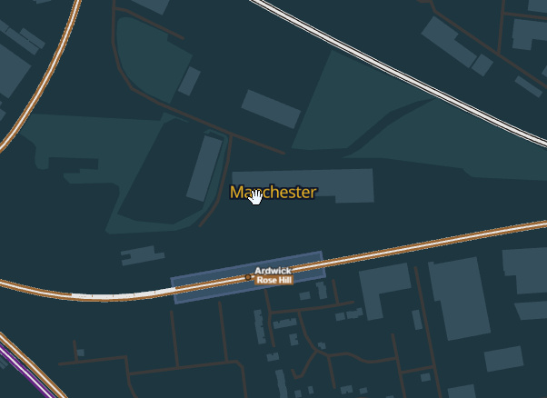
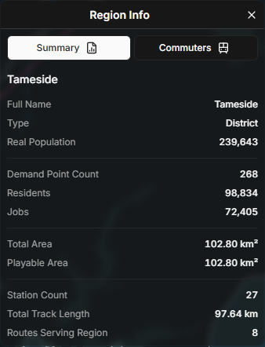

# subwaybuilder-regions

This repository contains a standalone mod, **SubwayBuilder Regions**, for the game [SubwayBuilder](https://www.subwaybuilder.com/).

## Summary

> **SubwayBuilder Regions** allows users to import real-world geographic regions (e.g. ZIP codes, counties, wards) into the game SubwayBuilder,
>
> The mod adds a visualization layer on top of the in-game map as well as additional panels for region-based statistics such as population, commuter flows, and infrastructure.

_Latest Mod Version:_ `v0.2.1`  
_Latest Tested Game Version:_ `v1.0.2`

## Table of Contents

- [Features](#features)
- [Specifications](#specifications)
- [Installation](#installation)
  - [General User Installation](#general-user-installation)
  - [Dev Installation](#dev-installation)
- [Usage](#usage)
- [Planned Features](PLANNED_FEATURES.md#planned-features)
- [Known Issues](KNOWN_ISSUES.md#known-issues)
- [Changelog](CHANGELOG.md#changelog)
- [Contributing](#contributing)
  - [Developer Commands](#developer-commands)
- [Credits](#credits)

## Features

- **Interactive Map Layers**: Displays region-based data as interactive layers on the in-game map.
  - Multi different region layers can be loaded per city
  - Each region layer is exposed in the game's `Map Layers` toggle screen
- **Region-Level Information**: Information for the following is exposed to the user when a region is selected:
  - Region Characteristics (total population / area / etc.)
  - Commuter Data (origin / destination by region / etc.)
  - Infrastructure Data (station count / track length / routes / etc.)
- **Dynamic Data State**: Region-based data is dynamically updated based on the game state
  - :information_source: Currently, this is limited to just the commuter data
- **Preset Regions**: Scripts to obtain region boundaries for the following real-world geographical divisions are provided:
  - **GB** (United Kingdom)
    - Local Authority Districts
    - Built-up Areas
    - Electoral Wards
  - **US** (United States)
    - Counties
    - County Subdivisions (including towns/cities/CDPs)
    - ZIP Code Tabulation Areas

## Specifications

- **Region Data**:
  - Region boundary data is stored on the local machine in GeoJSON format
  - :warning: Features must have Polygon/MultiPolygon geometry
  - :warning: Overlapping boundary data will likely cause issues. Avoid if possible during pre-processing
- **Local Data Server**:
  - Currently, data is exposed to the game via a configurable local HTTP server (`scripts/serve-data.ts`)
  - This will be moved to local storage as the mod API matures
- **Key Files/Directories**:
  ```
  - data/                   -- Output directory for boundary data
    - data_index.json       -- JSON file of available datasets (for consumption by mod)
  - scripts/                -- Scripts for downloading / serving local data
  - src/                    -- Core mod logic
  - shared/                 -- Shared values between dev / runtime
  - source_data/            -- Folder for pre-downloaded boundary source data
    - boundaries.csv        -- CSV of city codes to boundary boxes
  ```

### GeoJSON Feature Requirements

- **Required**
  - `ID` - unique identifier
  - `NAME`

- **Optional**
  - `DISPLAY_NAME`
  - `POPULATION`
  - `TOTAL_AREA`
  - `AREA_WITHIN_BBOX`

## Installation

### General User Installation

> :warning: This mod currently does not have a prebuilt release.
> General users will need to wait for a release package to be available.

### Dev Installation

1. Clone repository & Install dependencies

   ```
     git clone https://github.com/ahkimn/subwaybuilder-regions.git;
     cd subwaybuilder-regions;
     npm install
   ```

2. Update City Config (Optional)

   The `boundaries.csv` contains the boundary box for clipping regions to all of the game's current cities. If you are working on a custom city, please add an entry for the custom city within the file

3. Build Boundary GeoJSONs

   From the project repository root, run

   ```
   npm run extract:map-features -- -- \
     --country-code=US \
     --data-type=zctas \
     --city-code=DEN
   ```

   Or if on Linux/MacOS

   ```
   npx tsx scripts/extract-map-features.ts \
    --country-code=US \
    --data-type=zctas \
    --city-code=DEN
   ```

   To override the boundaries set in `boundaries.csv`, manually provide a boundary box

   ```
   npm run extract:map-features -- -- \
     --country-code=US \
     --data-type=zctas \
     --city-code=DEN \
     --west=-105.2 \
     --south=39.5 \
     --north=40.1 \
     --east=-104.6
   ```

   This command generates clipped GeoJSON files under `data/`, which are later served to the game via the local data server.

   **Preset Parameters**

   The following are the current valid combinations of `country-code` and `data-type` for preset data

   | `country-code` | `data-type `        | description                             | source                |
   | -------------- | ------------------- | --------------------------------------- | --------------------- |
   | **GB**         | districts           | Local Authority Districts (LADs)        | ONS (online)          |
   | **GB**         | bua                 | Built Up Areas                          | ONS (online)          |
   | **GB**         | wards               | Electoral Wards                         | ONS (online)          |
   | **US**         | counties            | Counties                                | TIGERweb API (online) |
   | **US**         | county-subdivisions | County Subdivisions (Towns/Cities/CDPs) | TIGERweb API (online) |
   | **US**         | zctas               | ZIP Code Tabulation Areas               | TIGERweb API (online) |

   :warning: If boundaries are not provided, `city-code` must be in `boundaries.csv`

4. Serve Local Data
   From the repository root, run:

   ```
   npm run serve
   ```

   By default this serves: http://127.0.0.1:8080.

5. Build
   From the repository root, run:

   ```
   npm run build
   ```

   This will build the `index.js` in `dist/`

6. Install

   Move the built `index.js` as well as the mod's `manifest.json` in the root directory to the mod's folder in the game's mod directory.

   Alternatively, use the following command (requires `config.yaml`) to create symlinks between the dev folder and the mod directory:

   ```
   npm run link
   ```

   The `config.yaml` file can be created from `config.example.yaml` and updating the `gamePath` / `baseModsDir` / `modDirName`.

7. Validate Behavior

   Configure `config.yaml`. Then, use the following command to run the game from terminal with the Console enabled.

   ```
   npm run dev

   ```

8. Contribute

   Once new behavior is verified, run code quality checks before opening a PR:

   ```
   npx tsc --noEmit
   npm run lint
   npm run format:check
   ```

### Disclaimer

> :warning: This mod was developed on Windows, behavior on other platforms is undetermined
>
> If you encountered issues while working with the mod, please:
>
> - Raise an issue (see [Contributing](#contributing)) on the repository
> - Send a message within the mod's dedicated thread within the game's [Discord server](https://discord.gg/97JhJprW)

## Usage

This section covers the core mod functionalities and their usage.

### Toggling Map Layers

Each GeoJSON installed will correspond to a single map layer for a city.

Installed map layers are accessible via the game's existing `Map Layers` menu. The mod injects a new section of toggle buttons `Region Data Layers` to this dropdown panel.


Clicking on these toggles will enable/disable the display of the corresponding map layer.

### Selecting A Region

Once a map layer is toggled on, the boundaries of regions within the map layer will be rendered on the screen.

The labels for each region are clickable, and will change color when hovered over. Click on the label to activate selection for the corresponding region.



If a region is already selected, clicking on its label will remove selection. Clicking a different region will switch the selection to that region.

### Info Panel

Once any new region is selected, the Regions Info panel will open in the top right corner of the screen

#### Summary View



The initial `Summary` panel contains overall summary statistics about the selected region.

You can swap between this view and the other `Commuters` view described below by clicking on the buttons at the top of the panel.

:warning: The first time a region is selected, infrastructure data is calculated asynchronously and may take some time to render on the panel.

#### Commuters View

The commuters view for a region contains a breakdown of commuter counts and commuter mode share. There are two views for this panel. `Residents` and `Workers`.

- `Residents` refer to commuters who reside within the selected region
- `Workers` refer to commuters who work within the selected region
- :information_source: A commuter can be both a `Resident` and a `Worker` of the same region if both their residence and workplace are within the region's boundaries


The upper portion of the view contains statistics of `Resident` and `Worker` counts and mode share aggregated for the selected region.

The lower portion of the view consists of a table breaking this information down for other regions within the same dataset.

You can sort the table by clicking on column headers. If there is a tie, the previous sort column and/or the region name are used as tiebreakers.

Use the footer to expand and show additional rows when available.

:information_source: The `Commuters` view is automatically updated with fresh demand data if at least 15 in-game minutes have passed.

## Planned Features

See [PLANNED_FEATURES.md](PLANNED_FEATURES.md) for the current list of planned features and long-term ideas.

## Known Issues

See [KNOWN_ISSUES.md](KNOWN_ISSUES.md) for the current list of major/minor issues and workarounds.

## Changelog

See [CHANGELOG.md](CHANGELOG.md#changelog) for full release notes.

## Contributing

Issues and Pull Requests are welcome. Please include:

- Game version
- Mod version
- Platform
- Other Relevant Details

### Developer Commands

The following are developer commands available within the repository, grouped by purpose:

#### Quality Checks

- `npm run lint`: Runs ESLint checks for `src/` and `scripts/`.
- `npm run lint:fix`: Applies auto-fixable ESLint changes (import ordering, etc.).
- `npm run format`: Applies Prettier formatting for repository files.
- `npm run format:check`: Verifies Prettier formatting without modifying files.
- `npx tsc --noEmit`: Runs TypeScript checks.

#### Build / Run

- `npm run build`: Builds and packages `src/` into `dist/index.js`.
- `npm run build:dev`: Builds `dist/index.js` then launches the game.
- `npm run dev`: Launches SubwayBuilder with debug mode enabled.
- `npm run link`: Creates a symlink for `dist/index.js` in the game's mod directory.

#### Data Extraction / Serving

- `npm run extract:map-features`: Extracts boundary GeoJSONs for a city for use by the mod.
- `npm run serve`: Launches a local HTTP server to serve GeoJSON files from `data/`.

## Credits

Mod developed by [ahkimn](https://github.com/ahkimn)

MIT License
